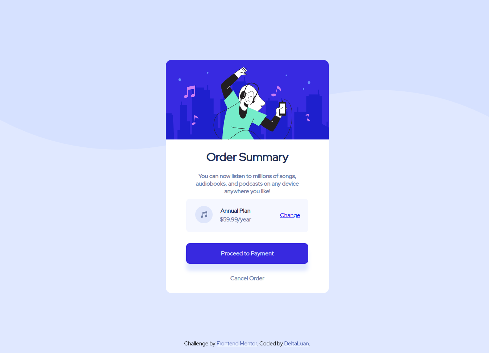

# Frontend Mentor - Order summary card solution

Isto é uma solução do [Order summary card challenge on Frontend Mentor](https://www.frontendmentor.io/challenges/order-summary-component-QlPmajDUj).

## Geral 

### Screenshot

### Links 

- Solution URL: [Solução do desafio]()
- Live Site URL: [Site]()

## Processo de construção

### Ferramentas utilizadas

- HTML5
- CSS 
- Flexbox

### O que aprendi

Ao concluir o desafio, aprimorei de certa forma a lidar com Flexbox, embora que ainda tenho muito para aprender - particularmente com alinhamento de elementos no CSS em si.

### Desenvolvimento futuro

Ao perceber que devo aprimorar minhas habilidades com alinhamento de elementos, colocarei meus esforços para aprender esta parte.

## Autor

- Frontend Mentor - [@DeltaLuan](https://www.frontendmentor.io/profile/deltaluan)