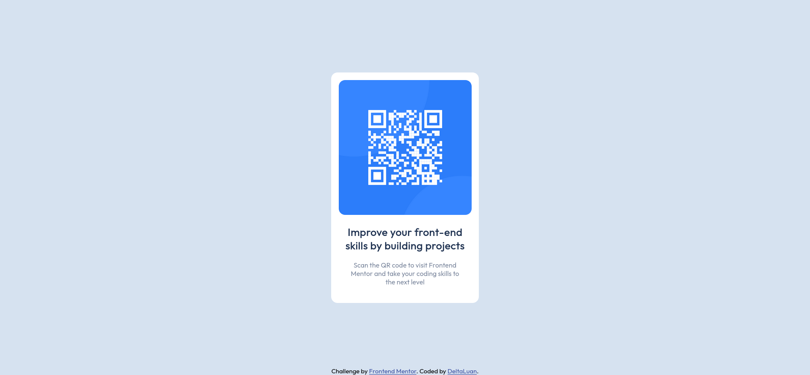

# Frontend Mentor - QR code component solution

Isto é uma solução do [QR code component challenge no Frontend Mentor](https://www.frontendmentor.io/challenges/qr-code-component-iux_sIO_H).

## Geral

### Screenshot

### Links

- Solution URL: [Add solution URL here](https://your-solution-url.com)
- Live Site URL: [Add live site URL here](https://your-live-site-url.com)

## Processo de construção

### Ferramentas utilizadas

- HTML5
- CSS 
- Flexbox

### O que aprendi

Ao realizar este desafio, aprendi a colocar HTML e CSS em algo prático como um cartão de QRCode, além de lidar brevemente com Flexbox.

### Desenvolvimento futuro

Além de ter utilizado o conteúdo aprendido de forma prática, também utilizarei desta experiência para aprimorar minha prática com layouts em CSS.

## Autor

- Frontend Mentor - [@DeltaLuan](https://www.frontendmentor.io/profile/deltaluan)

